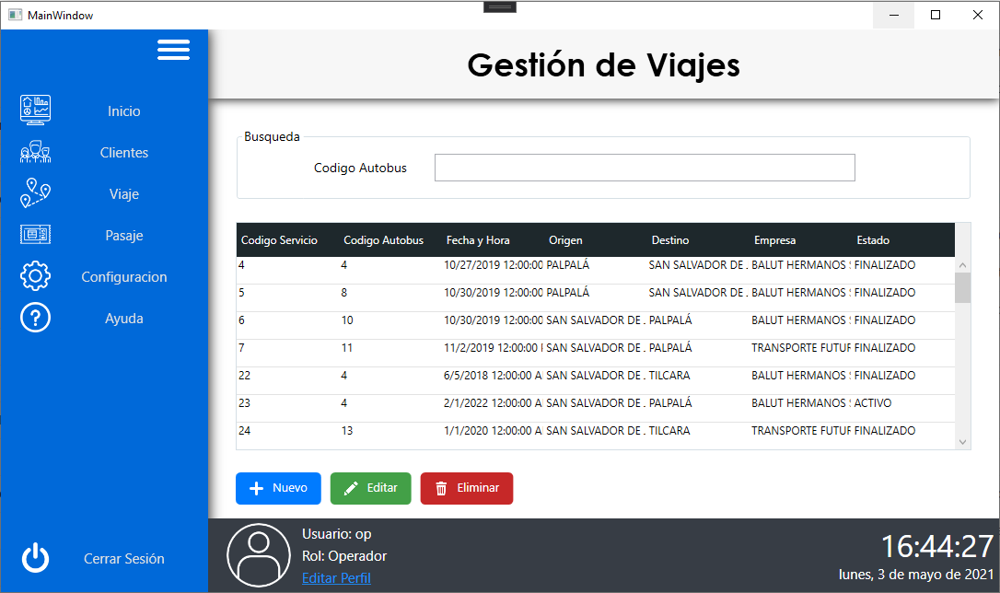
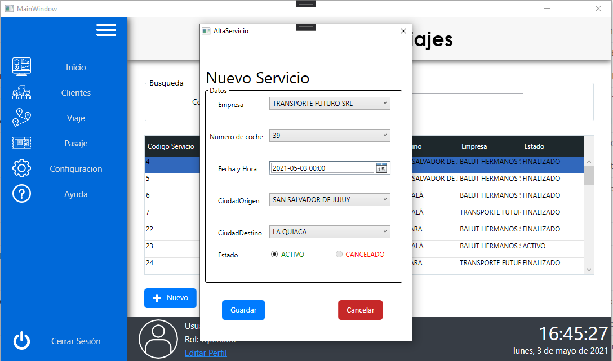
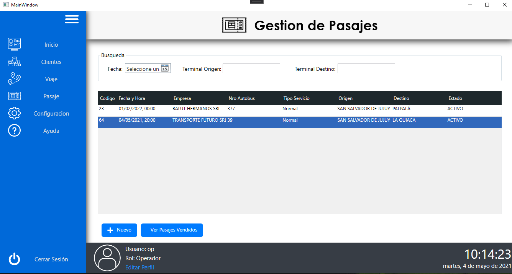
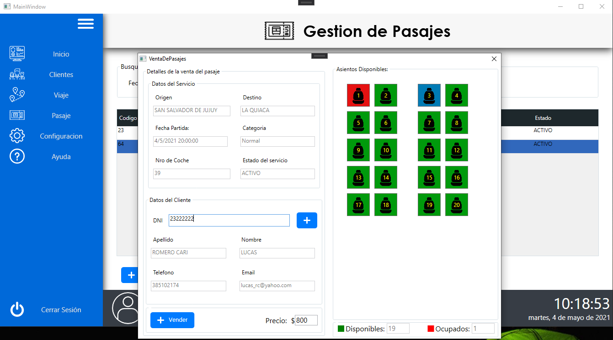
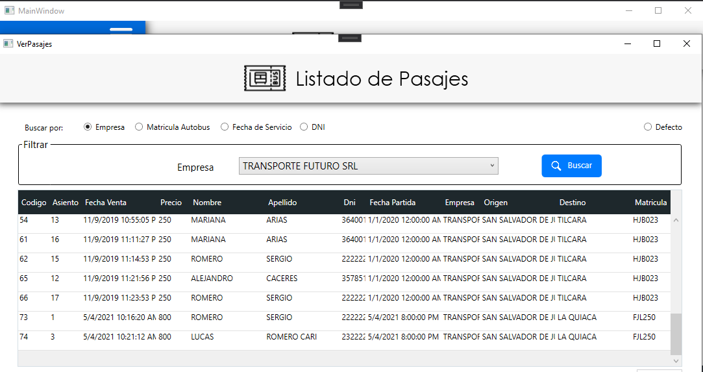

# Proyecto Final - Sistema de gestión de Viajes
Proyecto Desktop Implementado con .NET: C#, WPF y ADO.NET. 
Para la materia Laboratorio de Programación Orientada a Objetos 2 - UNJu, Año 2019

## Capturas de pantallas de algunas interfaces del sistema

## Viajes - Listado general

## Viajes - Nuevo

## Pasajes - Listado general

## Pasajes - Venta de pasaje

## Pasajes - Reporte de Pasajes por diferentes filtros
